# ooda-tui

A generic coding harness with openOODA-aware defaults. v0.1.3 is
line-mode chrome with slash commands, config load, and a real LLM
round-trip via curl. Connects to `ooda-mcp` when installed. Renders
the 1982 CRT amber/phosphor theme by default (`minimax` also ships).
Raw TTY / alt-screen is v0.2.0, blocked on the oodar tui_host shim.

## Current Build Status & What's Next

### Build Status (Inverted Layout Re-Architecture — v0.3.3-dev)
- **Milestone 1 (Header Input Dock)**: **CERTIFIED (PASS)**. Relocated framed prompt box to Rows 1–3 (`ui/input/input_header.oo`) with hardware cursor placement (`\x1b[2;5H`) keeping typed input cleanly inside the box.
- **Milestone 2 (Environmental Footer Dashboard)**: **CERTIFIED (PASS)**. Relocated all operational metadata (LLM model, CWD, thinking level, mode, permissions, MCP/LSP) to bottom statusbar (`ui/statusbar/statusbar_footer.oo`) with responsive width budgeting down to 40 columns.
- **Milestone 3 (Thought Stream & Canvas Viewport)**: **CERTIFIED (PASS)**. Intermediate scrollable viewport with collapsible reasoning card (`ui/cards/card_thought.oo`), isolating `<think>` tokens from conversational history with word wrapping and border symmetry.
- **Quality & Parity**:
  - Full 138-test Opaque-box E2E suite passed under Double-Run law ($Run_1 == Run_2$) (`TEST_READY.md`).
  - 25/25 hostile geometry tests and 46/46 boundary tests passed clean.
  - 100% compliant with ASD-STE100 Academy docstrings and 256-line file limits.
  - Cryptographic release binary parity certified bit-for-bit against `~/.openooda/bin/{ooda-tui,tui}` (`66bf92e9...`).

### What's Next (Milestone 4 & Release)
- **Milestone 4**: Dynamic Thinking Ticker (`ui/indicators/indicator_ticker.oo`) with animated 10-frame Braille spinner (`⠋ ⠙ ⠹ ⠸ ⠼ ⠴ ⠦ ⠧ ⠇ ⠏`), token velocity (`tok/s`), and elapsed duration on Row 4, alongside master plugin decoupling in `plugins/registry.oo`.
- **Milestone 5**: Final full-stack regression certification, release tagging (`v0.3.3`), and GitHub release asset compilation.

## Install

```sh
curl -fsSL https://openooda.org/install.sh | bash
```

The installer places `ooda-tui` in `~/.openooda/bin/` (path is added
to your shell rc). `ooda-mcp` and `ooda-lsp` must also be installed for
the harness to connect to its tool surface.

## Usage

```sh
ooda-tui
ooda-tui --teamwork
ooda-tui --provider anthropic --model claude-sonnet-4.5
ooda-tui --cwd ~/Projects/myapp --yolo
```

## Slash commands

Enter in the TUI input box (start with `/`):

```
/login [provider]   /logout [provider]   /providers
/model [provider:model]
/plan [text]        /goal [text]
/clear              /compact
/resume [id]        /rename <name>
/settings           /status
/btw <question>
/team <sub> [args]
/theme [name]
/help
/exit  /quit
```

## Keybindings

| Key | Action |
|-----|--------|
| Ctrl+T | Toggle teamwork (multi-agent) mode |
| Ctrl+Y | Toggle yolo (auto-approve all tool calls) |
| Ctrl+C | Cancel current tool call (or exit if idle) |
| Ctrl+D | Exit TUI (saves session first) |
| Ctrl+L | Clear screen, redraw |
| Ctrl+R | Reverse search history |

## Environment

| Variable | Required | Purpose |
|----------|----------|---------|
| `OODACODEX` | yes | Path to a `.oot` file (e.g. `northstar.oot`) |
| `OODA_COMPILER` | optional | Path to `oodac` (for diagnostics) |
| `OODA_FS_READDIR` | optional | Landlock read scope (forwarded to ooda-mcp) |
| `OODA_FS_WRITEDIR` | optional | Landlock write scope (forwarded to ooda-mcp) |
| `OODA_TUI_VERSION` | optional | Override version string |

## Configuration

`~/.config/ooda-tui/config.oot` (mode 0600) holds provider credentials
and session defaults. See `examples/config.oot` for a sample.

## Sessions

Per-session state lives in
`~/.local/share/ooda-tui/sessions/<sid>/`. Files per session:
`meta.json`, `transcript.jsonl`, `compacted.json`, `plan.json`,
`goal.txt`. See `examples/session.oot`.

## Build from source

```sh
export OODA_COMPILER="$HOME/.openooda/bin/oodac"
ooda build main.oo -o dist/ooda-tui
```

## The Polyrepo

`ooda-tui` is one of 13 repos in the openOODA polyrepo.

| Repo | Purpose |
|------|---------|
| [openOODA/openOODA](https://github.com/openOODA/openOODA) | Governance, RFCs, laws |
| [openOODA/oodar](https://github.com/openOODA/oodar) | Runtime substrate |
| [openOODA/oodac](https://github.com/openOODA/oodac) | Compiler |
| [openOODA/std](https://github.com/openOODA/std) | Standard library |
| [openOODA/ooda](https://github.com/openOODA/ooda) | `ooda` workflow driver |
| [openOODA/install](https://github.com/openOODA/install) | How the toolchain lands |
| [openOODA/opm](https://github.com/openOODA/opm) | Package manager |
| [openOODA/catalog](https://github.com/openOODA/catalog) | Public package catalog |
| [openOODA/lsp](https://github.com/openOODA/lsp) | Language server |
| [openOODA/mcp](https://github.com/openOODA/mcp) | MCP server |
| [openOODA/bb](https://github.com/openOODA/bb) | Flight recorder and crash autopsy |
| [openOODA/website](https://github.com/openOODA/website) | Website source |
| [openOODA/ooda-tui](https://github.com/openOODA/ooda-tui) | This repo |

## License

Dual-licensed under your choice of MIT or Apache 2.0. See `LICENSE`.

---

<div align="center">

[](https://necrometer.dev/?u=openOODA)

</div>
